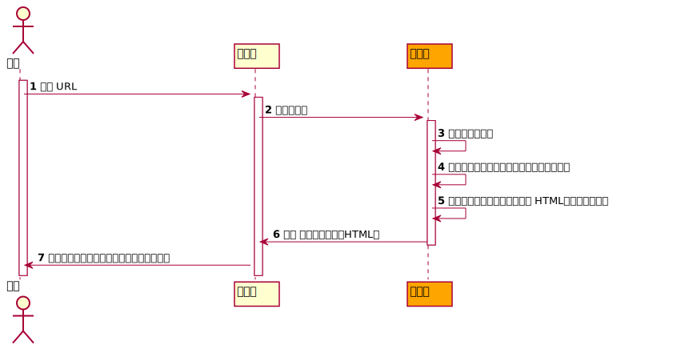
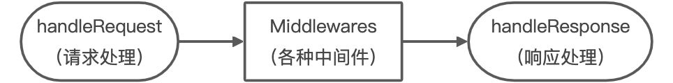
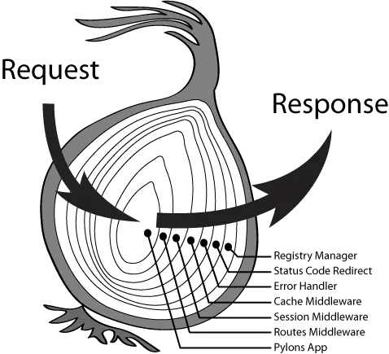

# 再次思考：从浏览器输入 URL 到页面展示过程的过程中发生了什么？

通过前面的基础学习，我们了解了基于 Web 的应用基本流程：



通过上图不难发现，无论具体应用功能如何变化， `服务端` 处理任务核心三个步骤：③、④、⑤ 中，③ 和 ⑤ 的模式基本是固定的（因为HTTP协议规范了），而 ④ 是最大的变量。

如果我们每次开发一个新的应用都要把 ③ 和 ⑤ 的逻辑重新实现一遍就会特别的麻烦。所以，我们可以封装一个框架（库）把 ③ 和 ⑤ 的逻辑进行统一处理，然后通过某种方式，把 ④ 的处理暴露给框架使用者。


# Koa

**资源：** 

官网：https://koajs.com/

中文：https://koa.bootcss.com/


- 基于 NodeJS 的 web 框架，致力于 web 应用和 API 开发。
- 由 Express 原班人马打造。
- 支持 async。
- 更小、更灵活、更优雅。


## 安装

> 当前最新 Koa 依赖 node v7.6.0+、ES2015+ 以及 async 的支持。
>
> 具体请关注官网说明（依赖会随着版本的变化而变化）。
>
> 参考：https://koajs.com/#introduction


```
# 安装 koa
npm i koa

# 或者
yarn add koa
```


# 核心

`Koa` 对 `NodeJS` 原生  `IncomingMessage` 和 `ServerResponse` 对象和解析响应通用流程进行了包装，并提供了几个核心类（对象）用于其它各种用户业务调用。


- Application 对象
- Context 对象
- Request 对象
- Response 对象


# Application 对象

该对象是 `Koa` 的核心对象，通过该对象来初始化并创建 `WebServer` 。

```
/**
 * File: /node_modules/koa/lib/application.js
***/

constructor(options) {
  super();
  options = options || {};
  this.proxy = options.proxy || false;
  this.subdomainOffset = options.subdomainOffset || 2;
  this.proxyIpHeader = options.proxyIpHeader || 'X-Forwarded-For';
  this.maxIpsCount = options.maxIpsCount || 0;
  this.env = options.env || process.env.NODE_ENV || 'development';
  if (options.keys) this.keys = options.keys;
  this.middleware = [];
  this.context = Object.create(context);
  this.request = Object.create(request);
  this.response = Object.create(response);
  if (util.inspect.custom) {
    this[util.inspect.custom] = this.inspect;
  }
}
```

构造函数对 `Application` 创建进行了一些初始化工作，暂时不需要关注这里的太多细节，后续关注。

**应用代码** 

```
/**
 * File: /app.js
***/

const Koa = require('koa');

const app = new Koa();
```


## listen 方法

`WebServer` 并不是在 `Application` 对象创建的时候就被创建的，而是在调用了 `Application` 下的 `listen` 方法的时候在创建。

```
/**
 * File: /node_modules/koa/lib/application.js
***/

listen(...args) {
  debug('listen');
  const server = http.createServer(this.callback());
  return server.listen(...args);
}
```

通过源码可以看到，其本质还是通过 `NodeJS` 内置的 `http` 模块的 `createServer` 方法创建的 `Server` 对象。并且把 `this.callback()` 执行后的结果（函数）作为后续请求的回调函数。

```
/**
 * File: /node_modules/koa/lib/application.js
***/

callback() {
  const fn = compose(this.middleware);

  if (!this.listenerCount('error')) this.on('error', this.onerror);

  const handleRequest = (req, res) => {
    const ctx = this.createContext(req, res);
    return this.handleRequest(ctx, fn);
  };

  return handleRequest;
}
```

通过上述代码的分析，实际上请求执行的回调函数式 `callback` 返回的 `handleRequest` 函数，且该函数接收的 `req` 和 `res` 参数就是 `NodeJS` 中 `HTTP` 模块内置的两个对象  `IncomingMessage` 和 `ServerResponse` 对象。其中：

```
const ctx = this.createContext(req, res);
```

这里， `Koa` 会调用 `Application` 对象下的 `createContext` 方法对 `req` 和 `res` 进行包装，生成 `Koa` 另外一个核心对象： `Context` 对象 - 后续分析。

```
return this.handleRequest(ctx, fn);
```

接着调用 `Application` 对象下的 `handleRequest` 方法进行请求处理，并传入：

- ctx: 前面提到的 `Context` 对象。
- fn: 这个实际上是 `const fn = compose(this.middleware);` 这段代码得到的是一个执行函数，这里又称为： `中间件函数` 。

**应用代码** 

```
/**
 * File: /app.js
***/

const Koa = require('koa');

const app = new Koa();

app.listen(8888);
```

## 中间件函数

所谓的中间件函数，其实就是一开始我们提到的 ④，首先， `Application` 对象中会提供一个属性 `this.middleware = [];` ，它是一个数组，用来存储 ④ 需要处理的各种业务函数。这些业务函数会通过 `Application` 下的 `use` 方法进行注册（类似事件注册）。

### 为什么叫中间件

因为它是在 `请求` 之后， `响应` 之前调用的函数，所以就叫它 `中间件函数` 。

## 响应流程处理

通过上述流程分析，可以看到，每一个请求都会执行到 `Application` 对象下的 `handleRequest` 方法。

```
/**
 * File: /node_modules/koa/lib/application.js
***/

handleRequest(ctx, fnMiddleware) {
  const res = ctx.res;
  res.statusCode = 404;
  const onerror = err => ctx.onerror(err);
  const handleResponse = () => respond(ctx);
  onFinished(res, onerror);
  return fnMiddleware(ctx).then(handleResponse).catch(onerror);
}
```

这里的 `fnMiddleware` 就是一系列中间件函数执行后结果（一个 `Promise` 对象），当所有中间件函数执行完成以后，会通过 `then` 调用 `handleResponse` ，也就是调用了 `respond` 这个方法。

### 响应处理

```
/**
 * File: /node_modules/koa/lib/application.js
***/

function respond(ctx) {
  // allow bypassing koa
  if (false === ctx.respond) return;

  if (!ctx.writable) return;

  const res = ctx.res;
  let body = ctx.body;
  const code = ctx.status;

  // ignore body
  if (statuses.empty[code]) {
    // strip headers
    ctx.body = null;
    return res.end();
  }

  if ('HEAD' === ctx.method) {
    if (!res.headersSent && !ctx.response.has('Content-Length')) {
      const { length } = ctx.response;
      if (Number.isInteger(length)) ctx.length = length;
    }
    return res.end();
  }

  // status body
  if (null == body) {
    if (ctx.req.httpVersionMajor >= 2) {
      body = String(code);
    } else {
      body = ctx.message || String(code);
    }
    if (!res.headersSent) {
      ctx.type = 'text';
      ctx.length = Buffer.byteLength(body);
    }
    return res.end(body);
  }

  // responses
  if (Buffer.isBuffer(body)) return res.end(body);
  if ('string' == typeof body) return res.end(body);
  if (body instanceof Stream) return body.pipe(res);

  // body: json
  body = JSON.stringify(body);
  if (!res.headersSent) {
    ctx.length = Buffer.byteLength(body);
  }
  res.end(body);
}
```

上面这个函数就是 `Koa` 在处理完各种中间件函数以后，最后进行响应的逻辑。

## Koa 的流程




# 中间件

首先，  `Application` 对象通过一个数组来存储中间件：

```
/**
 * File: lib/application.js
***/

constructor() {
    // ...
  this.middleware = [];
  // ...
}
```

## 注册中间件函数

其次，`Application` 对象提供了一个 `use` 方法来注册中间件函数：

```
/**
 * File: lib/application.js
***/
  
use(fn) {
  if (typeof fn !== 'function') throw new TypeError('middleware must be a function!');
  if (isGeneratorFunction(fn)) {
    deprecate('Support for generators will be removed in v3. ' +
              'See the documentation for examples of how to convert old middleware ' +
              'https://github.com/koajs/koa/blob/master/docs/migration.md');
    fn = convert(fn);
  }
  debug('use %s', fn._name || fn.name || '-');
  this.middleware.push(fn);
  return this;
}
```

**应用代码** 

```
/**
 * File: /app.js
***/

const Koa = require('koa');

const app = new Koa();

app.use( (ctx) => {
  ctx.body = 'Hello!';
} );

app.listen(8888);
```

## 中间件的执行

中间件的执行实际来源另外一个独立模块： `koa-compose` 提供的 `compose` 函数。

```
/**
 * File: lib/application.js
***/

callback() {
  const fn = compose(this.middleware);

  // ...
}
/**
 * Module: koa-compose
 * File: index.js
***/

function compose (middleware) {
  if (!Array.isArray(middleware)) throw new TypeError('Middleware stack must be an array!')
  for (const fn of middleware) {
    if (typeof fn !== 'function') throw new TypeError('Middleware must be composed of functions!')
  }

  /**
   * @param {Object} context
   * @return {Promise}
   * @api public
   */

  return function (context, next) {
    // last called middleware #
    let index = -1
    return dispatch(0)
    function dispatch (i) {
      if (i <= index) return Promise.reject(new Error('next() called multiple times'))
      index = i
      let fn = middleware[i]
      if (i === middleware.length) fn = next
      if (!fn) return Promise.resolve()
      try {
        return Promise.resolve(fn(context, dispatch.bind(null, i + 1)));
      } catch (err) {
        return Promise.reject(err)
      }
    }
  }
}
```

### compose 函数

组合 - 把多个函数组合成一个函数执行。

上面这个 `compose` 函数核心就在：

```
Promise.resolve(fn(context, dispatch.bind(null, i + 1)));
```

它会在执行当前中间件函数的时候，把下一个中间件函数作为当前中间件函数的第二个参数传入（next）。这样就可以实现对多个中间件函数执行流程进行把控。

**应用代码** 

```
/**
 * File: /app.js
***/

const Koa = require('koa');

const app = new Koa();

app.use(async ctx => {
   console.log('a');
});

app.use(async ctx => {
    console.log('b');
 });

 app.use(async ctx => {
    console.log('c');
 });

app.use(async ctx => {
    console.log('d');
});

app.listen(8888);
```

**输出** 

```
a
```

我们会发现，当我们访问这个 `WebServer` 的时候，后端服务器上打印的只有  `a` 。这是因为当第一个中间件函数执行以后，后续的中间件是需要通过当前执行中间件函数的第二个参数去显式的调用才能执行的。

**应用代码** 

```
/**
 * File: /app.js
***/

const Koa = require('koa');

const app = new Koa();

app.use(async (ctx, next) => {
   console.log('a');
   next();
});

app.use(async (ctx, next) => {
    console.log('b');
    next();
 });

app.use(async (ctx, next) => {
    console.log('c');
    next();
 });

app.use(async (ctx, next) => {
    console.log('d');
    next();
});

app.listen(8888);
```

**输出** 

```
a
b
c
d
```

通过以上的代码改造，我们会发现就实现了 `a` 、 `b` 、 `c` 、 `d` 的输出了。

因为函数调用的栈（LIFO - Last In First Out - 后进先出）特性，所以：

**应用代码** 

```
/**
 * File: /app.js
***/

const Koa = require('koa');

const app = new Koa();

app.use(async (ctx, next) => {
   console.log('a - start');
   next();
   console.log('a - end');
});

app.use(async (ctx, next) => {
    console.log('b - start');
    next();
    console.log('b - end');
 });

app.use(async (ctx, next) => {
    console.log('c - start');
    next();
    console.log('c - end');
 });

app.use(async (ctx, next) => {
        console.log('d - start');
    next();
    console.log('d - end');
});

app.listen(8888);
```

**输出** 

```
a - start
b - start
c - start
d - start
d - end
c - end
b - end
a - end
```

我们给这种特性现象起了一个很形象的名字：

### 洋葱模型

### 

### 好处

框架这么设计的好处在哪呢？ - 扩展

**应用代码** 

```
/**
 * File: /app.js
***/

const Koa = require('koa');

const app = new Koa();

app.use(async (ctx, next) => {
   // 这是我们开始的某个业务逻辑
  ctx.body = 'hello';
});

app.listen(8888);
```

现在，我们希望在不改变原有中间件逻辑的基础上进行一些扩展，比如在现有 `body` 内容后面添加 `'，kkb!'` 这个字符串，我们就可以利用中间件特性来进行扩展了：

**应用代码** 

```
/**
 * File: /app.js
***/

const Koa = require('koa');

const app = new Koa();

// 在不改变原有中间件逻辑代码基础上进行扩展
app.use(async (ctx, next) => {
  // 注意这里，我们是要在原有中间件逻辑之后添加新的逻辑，所以先 调用 next。
  next();
  ctx.body += ', kkb!';
});

app.use(async (ctx, next) => {
   // 这是我们开始的某个业务逻辑
  ctx.body = 'hello';
});

app.listen(8888);
```

> next 调用取决中间件的具体需求。放置在你想要调用的任何阶段。

#### 异步的中间件

有的时候，我们的中间件逻辑中会包含一些异步任务：

**应用代码** 

```
/**
 * File: /app.js
***/

const Koa = require('koa');

const app = new Koa();

// 在不改变原有中间件逻辑代码基础上进行扩展
app.use(async (ctx, next) => {
  // 注意这里，我们是要在原有中间件逻辑之后添加新的逻辑，所以先 调用 next
  next();
  ctx.body += ', kkb!';
});

app.use(async (ctx, next) => {
    setTimeout(() => {
        ctx.body = 'hello';
    }, 1000);
});

app.listen(8888);
```

我们会发现，还不等定时器执行， `Koa` 就已经返回（处理响应了）。我们需要把任务包装成 `Promise` 的：

**应用代码** 

```
/**
 * File: /app.js
***/

const Koa = require('koa');

const app = new Koa();

// 在不改变原有中间件逻辑代码基础上进行扩展
app.use(async (ctx, next) => {
  // 注意这里需要使用 await 来处理异步的任务
  await next();
  ctx.body += ', kkb!';
});

app.use(async (ctx, next) => {
    // 返回一个 Promise
    return new Promise((resolve, reject) => {
        setTimeout(() => {
            ctx.body = 'hello';
            resolve();
        }, 1000);
    });
});

app.listen(8888);
```

**输出（客户端-如：浏览器）** 

```
hello, kkb!
```

> 注意：这里需要注意中间件的注册顺序！

**应用代码** 

```
/**
 * File: /app.js
***/

const Koa = require('koa');

const app = new Koa();

app.use(async (ctx, next) => {
    // 返回一个 Promise
    return new Promise((resolve, reject) => {
        setTimeout(() => {
            ctx.body = 'hello';
            resolve();
        }, 1000);
    });
});

// 在不改变原有中间件逻辑代码基础上进行扩展
app.use(async (ctx, next) => {
  // 注意这里需要使用 await 来处理异步的任务
  await next();
  ctx.body += ', kkb!';
});

app.listen(8888);
```

**输出（客户端-如：浏览器）**

```
hello
```


# Context 对象

`Koa` 的核心对象之一，它为 `Koa` 框架内部提供了重要的各种接口，同时也通过这个对象代理了 `Application` 、 `Request` 、 `Response` 对象的访问，简而言之，后续框架的提供的各种方法都是通过该对象来完成的。

```
/**
 * File: lib/application.js
***/

constructor() {
    // ...
  this.context = Object.create(context);
  // ...
}
```

## context 对象

这里的 `context` 对象，来源于 `lib/context.js` ，提供一些基础方法，同时对 `Request` 和 `Response` 对象做了代理访问：

```
/**
 * File: lib/context.js
***/
'use strict';

/**
 * Module dependencies.
 */

const util = require('util');
const createError = require('http-errors');
const httpAssert = require('http-assert');
const delegate = require('delegates');
const statuses = require('statuses');
const Cookies = require('cookies');

const COOKIES = Symbol('context#cookies');

/**
 * Context prototype.
 */

const proto = module.exports = {

  /**
   * util.inspect() implementation, which
   * just returns the JSON output.
   *
   * @return {Object}
   * @api public
   */

  inspect() {
    if (this === proto) return this;
    return this.toJSON();
  },

  /**
   * Return JSON representation.
   *
   * Here we explicitly invoke .toJSON() on each
   * object, as iteration will otherwise fail due
   * to the getters and cause utilities such as
   * clone() to fail.
   *
   * @return {Object}
   * @api public
   */

  toJSON() {
    return {
      request: this.request.toJSON(),
      response: this.response.toJSON(),
      app: this.app.toJSON(),
      originalUrl: this.originalUrl,
      req: '<original node req>',
      res: '<original node res>',
      socket: '<original node socket>'
    };
  },

  /**
   * Similar to .throw(), adds assertion.
   *
   *    this.assert(this.user, 401, 'Please login!');
   *
   * See: https://github.com/jshttp/http-assert
   *
   * @param {Mixed} test
   * @param {Number} status
   * @param {String} message
   * @api public
   */

  assert: httpAssert,

  /**
   * Throw an error with `status` (default 500) and
   * `msg`. Note that these are user-level
   * errors, and the message may be exposed to the client.
   *
   *    this.throw(403)
   *    this.throw(400, 'name required')
   *    this.throw('something exploded')
   *    this.throw(new Error('invalid'))
   *    this.throw(400, new Error('invalid'))
   *
   * See: https://github.com/jshttp/http-errors
   *
   * Note: `status` should only be passed as the first parameter.
   *
   * @param {String|Number|Error} err, msg or status
   * @param {String|Number|Error} [err, msg or status]
   * @param {Object} [props]
   * @api public
   */

  throw(...args) {
    throw createError(...args);
  },

  /**
   * Default error handling.
   *
   * @param {Error} err
   * @api private
   */

  onerror(err) {
    // don't do anything if there is no error.
    // this allows you to pass `this.onerror`
    // to node-style callbacks.
    if (null == err) return;

    if (!(err instanceof Error)) err = new Error(util.format('non-error thrown: %j', err));

    let headerSent = false;
    if (this.headerSent || !this.writable) {
      headerSent = err.headerSent = true;
    }

    // delegate
    this.app.emit('error', err, this);

    // nothing we can do here other
    // than delegate to the app-level
    // handler and log.
    if (headerSent) {
      return;
    }

    const { res } = this;

    // first unset all headers
    /* istanbul ignore else */
    if (typeof res.getHeaderNames === 'function') {
      res.getHeaderNames().forEach(name => res.removeHeader(name));
    } else {
      res._headers = {}; // Node < 7.7
    }

    // then set those specified
    this.set(err.headers);

    // force text/plain
    this.type = 'text';

    // ENOENT support
    if ('ENOENT' == err.code) err.status = 404;

    // default to 500
    if ('number' != typeof err.status || !statuses[err.status]) err.status = 500;

    // respond
    const code = statuses[err.status];
    const msg = err.expose ? err.message : code;
    this.status = err.status;
    this.length = Buffer.byteLength(msg);
    res.end(msg);
  },

  get cookies() {
    if (!this[COOKIES]) {
      this[COOKIES] = new Cookies(this.req, this.res, {
        keys: this.app.keys,
        secure: this.request.secure
      });
    }
    return this[COOKIES];
  },

  set cookies(_cookies) {
    this[COOKIES] = _cookies;
  }
};

/**
 * Custom inspection implementation for newer Node.js versions.
 *
 * @return {Object}
 * @api public
 */

/* istanbul ignore else */
if (util.inspect.custom) {
  module.exports[util.inspect.custom] = module.exports.inspect;
}

/**
 * Response delegation.
 */

delegate(proto, 'response')
  .method('attachment')
  .method('redirect')
  .method('remove')
  .method('vary')
  .method('has')
  .method('set')
  .method('append')
  .method('flushHeaders')
  .access('status')
  .access('message')
  .access('body')
  .access('length')
  .access('type')
  .access('lastModified')
  .access('etag')
  .getter('headerSent')
  .getter('writable');

/**
 * Request delegation.
 */

delegate(proto, 'request')
  .method('acceptsLanguages')
  .method('acceptsEncodings')
  .method('acceptsCharsets')
  .method('accepts')
  .method('get')
  .method('is')
  .access('querystring')
  .access('idempotent')
  .access('socket')
  .access('search')
  .access('method')
  .access('query')
  .access('path')
  .access('url')
  .access('accept')
  .getter('origin')
  .getter('href')
  .getter('subdomains')
  .getter('protocol')
  .getter('host')
  .getter('hostname')
  .getter('URL')
  .getter('header')
  .getter('headers')
  .getter('secure')
  .getter('stale')
  .getter('fresh')
  .getter('ips')
  .getter('ip');
```

### context 对象的初始化

通过上面代码，我们可以看到，在 `Application` 对象初始化的时候，会创建一个 `Context` 对象，并挂载到 `Application` 的 `context` 属性下。同时在中间件执行的时候，还会对这个 `context` 进行包装，并把包装后的 `context` 对象作为中间件函数的第一个参数进行传入，所以我们就可以通过中间件函数的第一个参数来调用这个 `context` 对象了。

```
/**
 * File: lib/application.js
***/

callback() {
  // ...
  const ctx = this.createContext(req, res);
  return this.handleRequest(ctx, fn);
}
/**
 * File: lib/application.js
***/

createContext(req, res) {
  const context = Object.create(this.context);
  const request = context.request = Object.create(this.request);
  const response = context.response = Object.create(this.response);
  context.app = request.app = response.app = this;
  context.req = request.req = response.req = req;
  context.res = request.res = response.res = res;
  request.ctx = response.ctx = context;
  request.response = response;
  response.request = request;
  context.originalUrl = request.originalUrl = req.url;
  context.state = {};
  return context;
}
```

### ctx.state 属性

有的时候，我们需要在多个中间件中传递共享数据，虽然我们可以通过 `context` 对象进行挂载，但是这样会对 `context` 对象造成污染， `context` 对象为我们提供了一个专门用来共享这类用户数据的命名空间（ `context.state = {}` ）。

**应用代码** 

```
/**
 * File: /app.js
***/

const Koa = require('koa');

const app = new Koa();

app.use(async (ctx, next) => {
  ctx.state.user = {id: 1, name: 'zMouse'};
});

app.use(async (ctx, next) => {
  ctx.body = `Hello, ${ctx.state.user.name}`;
});

app.listen(8888);
```

### ctx.throw([status], [msg], [properties])

用来手动抛出一个包含 状态码、状态码文本 以及 其它信息的错误。状态默认为：500。

**应用代码** 

```
/**
 * File: /app.js
***/

const Koa = require('koa');

const app = new Koa();

app.use(async (ctx, next) => {
  ctx.throw(401, 'access_denied', { user: user });
});

app.use(async (ctx, next) => {
  ctx.body = 'kkb!';
});

app.listen(8888);
```

### app.on('error', callback)

配合着 `Application` 对象的 `on` 方法（继承至 NodeJS 的 `Emitter` ）来捕获 `throw` 错误。

```
/**
 * File: lib/application.js
***/

module.exports = class Application extends Emitter {
  // ...
}
```

**应用代码** 

```
/**
 * File: /app.js
***/

const Koa = require('koa');

const app = new Koa();

app.on('error', async (err) => {
  console.log('error');
  // app 会自动根据错误向前端进行响应。
});

app.use(async (ctx, next) => {
  ctx.throw(401, 'access_denied', { user: user });
});

app.use(async (ctx, next) => {
  ctx.body = 'kkb!';
});

app.listen(8888);
```


# Request 对象

```
Koa` 通过 `Getter` 、 `Setter` 对 `Request` 进行了封装，具体代码： `node_modules/koa/lib/request.js
```


# Response 对象

```
Koa` 通过 `Getter` 、 `Setter` 对 `Response` 进行了封装，具体代码： `node_modules/koa/lib/response.js
```


# Context 代理

为了方便对 `Request` 和 `Response` 对象进行操作， `Koa` 通过 `delegates` 对 `Context` 进行了代理访问处理，使得可以通过 `Context` 即可操作对应的 `Request` 和 `Response` ：

```
/**
 * File: lib/context.js
***/

// ...

/**
 * Response delegation.
 */

delegate(proto, 'response')
  .method('attachment')
  .method('redirect')
  .method('remove')
  .method('vary')
  .method('has')
  .method('set')
  .method('append')
  .method('flushHeaders')
  .access('status')
  .access('message')
  .access('body')
  .access('length')
  .access('type')
  .access('lastModified')
  .access('etag')
  .getter('headerSent')
  .getter('writable');

/**
 * Request delegation.
 */

delegate(proto, 'request')
  .method('acceptsLanguages')
  .method('acceptsEncodings')
  .method('acceptsCharsets')
  .method('accepts')
  .method('get')
  .method('is')
  .access('querystring')
  .access('idempotent')
  .access('socket')
  .access('search')
  .access('method')
  .access('query')
  .access('path')
  .access('url')
  .access('accept')
  .getter('origin')
  .getter('href')
  .getter('subdomains')
  .getter('protocol')
  .getter('host')
  .getter('hostname')
  .getter('URL')
  .getter('header')
  .getter('headers')
  .getter('secure')
  .getter('stale')
  .getter('fresh')
  .getter('ips')
  .getter('ip');
```

## 参数：proto

`delegate` 的第一个参数 `proto` 就是 `Context` 对象。

## 参数：'response' 和 'response'

`delegate` 的第二个参数 `'response'` 和 `'request'` 就是需要被代理访问的 `Request` 对象和 `Response` 对象。

## method 方法

代理对象的对应方法。

## access 方法

代理对象属性的 `getter` 和 `setter`。

## getter 方法

代理对象属性的 `getter` 。

## setter 方法

代理对象属性的 `setter` 。