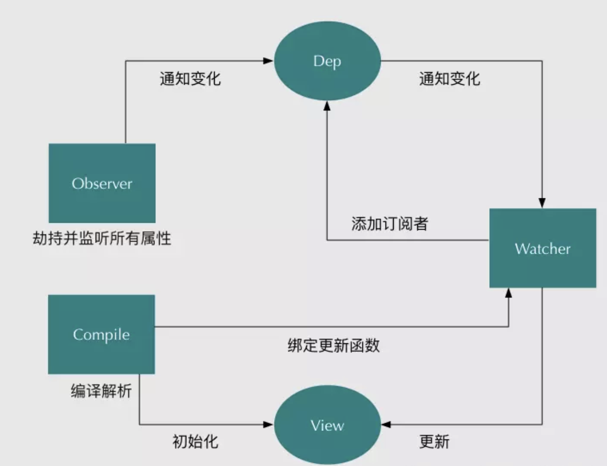

## 数据响应式

##课堂主题

- 1.利用defineProperty实现数据劫持
- 2.利用ES6中proxy实现数据劫持
- 3.实现数据驱动视图更新，实现数据响应
- 4.发布订阅模式
- 5.AMD模块化require.js介绍

##知识点

- defineProperty；
- Proxy代理
- 数据劫持
- 发布订阅
- 观察者模式与发布订阅
- 数据响应式

### defineProperty

```js
Object.defineProperty(obj,'name',{
        get(){
            return value;
        },
        set(newValue){
            console.log("set...");
            value = newValue;
        }
    })
```


### Proxy

- 定义  ：对象用于定义基本操作的自定义行为（如属性查找，赋值，枚举，函数调用等）。

- 基本使用

  ```js
  let obj = new Proxy({
                      name: "张三",
                      age: 20
                },{
                      get(target, name) {
                          return target[name];
                      },
                      set(target,name,value){
                          target[name] = value;
                      }
                 })
  ```

- 相关配置参数

  ```
  has(target, propKey)：拦截propKey in proxy的操作，返回一个布尔值。
  defineProperty(target, propKey, propDesc)：拦截Object.defineProperty(proxy, propKey, propDesc）、Object.defineProperties(proxy, propDescs)，返回一个布尔值。
  ```


##  通过数据劫持实现表达式

- 通过defineProperty劫持数据:observer


##发布订阅监听数据的更新

- 通过自定义事件触发更新
- 通过发布订阅模式触发更新

## 实现v-model

- 输入框赋值
- 监听输入事件

### 观察者模式

定义一个对象与其他对象之间的一种依赖关系，当对象发生某种变化的时候，依赖它的其它对象都会得到更新，一对多的关系。

### 发布订阅模式

**发布-订阅**是一种[消息](https://zh.wikipedia.org/wiki/消息)[范式](https://zh.wikipedia.org/wiki/范式)，消息的发送者（称为发布者）不会将消息**直接**发送给特定的接收者（称为订阅者）。而是将发布的消息分为不同的类别，无需了解哪些订阅者（如果有的话）可能存在。同样的，订阅者可以表达对一个或多个类别的兴趣，只接收感兴趣的消息，无需了解哪些发布者（如果有的话）存在。




### 二者关系

观察者模式观察者与订阅者之间有直接联系。发布订阅中发布者和订阅者无直接依赖关系。观察者模式属于紧解耦，发布订阅模式属于松解耦。发布订阅广义上是观察者模式。


## 总结

- defineProperty
- Proxy代理
- 数据劫持
- 发布订阅
- 数据响应式

## 下节预告

- 函数式编程

